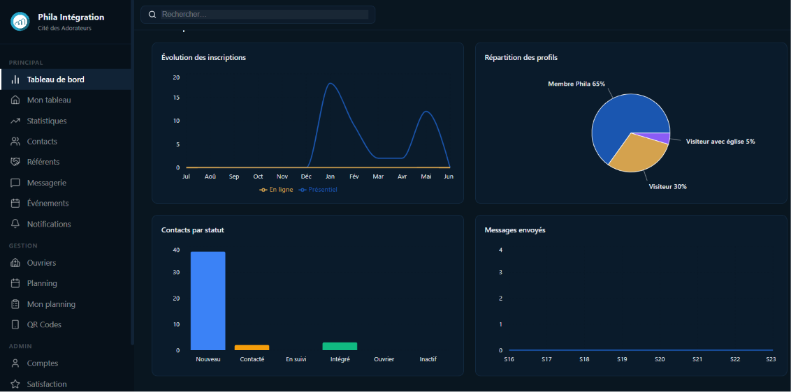
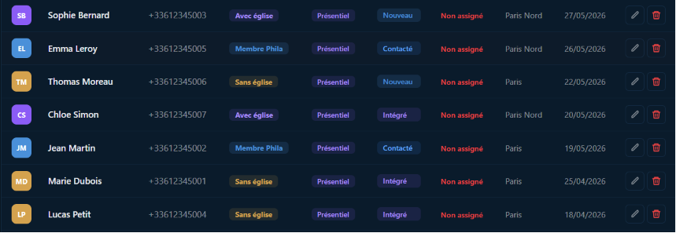
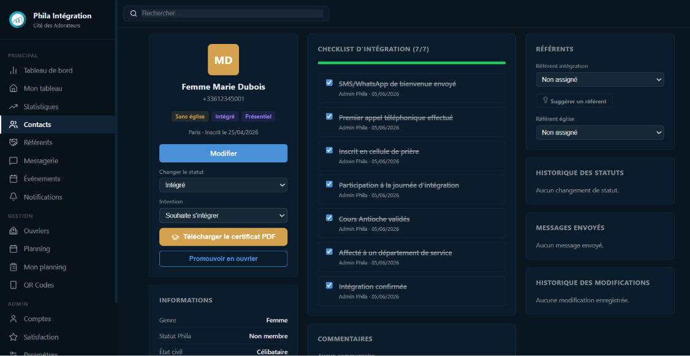
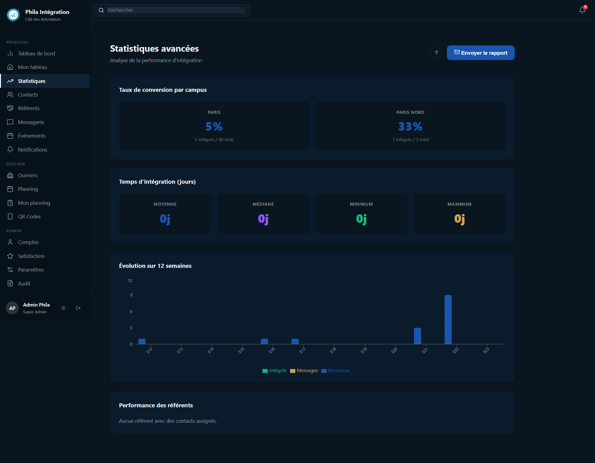
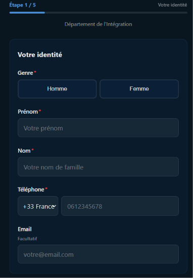
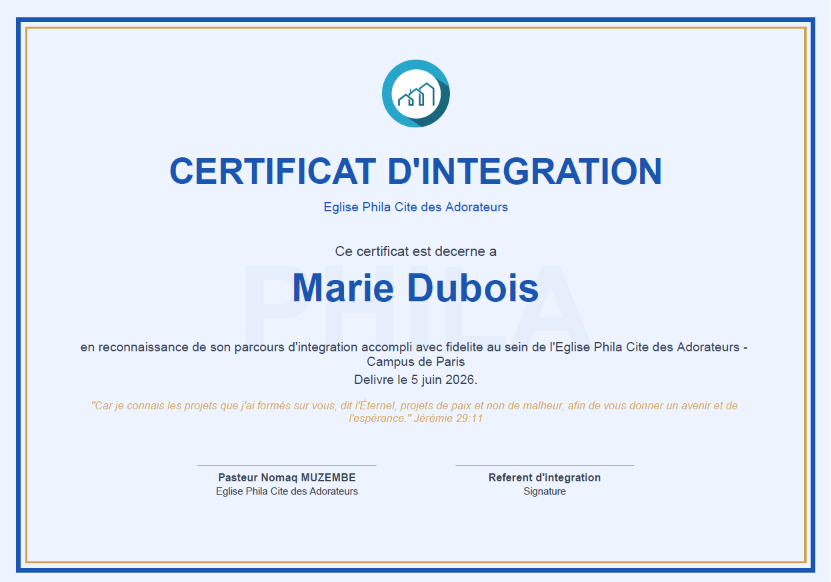
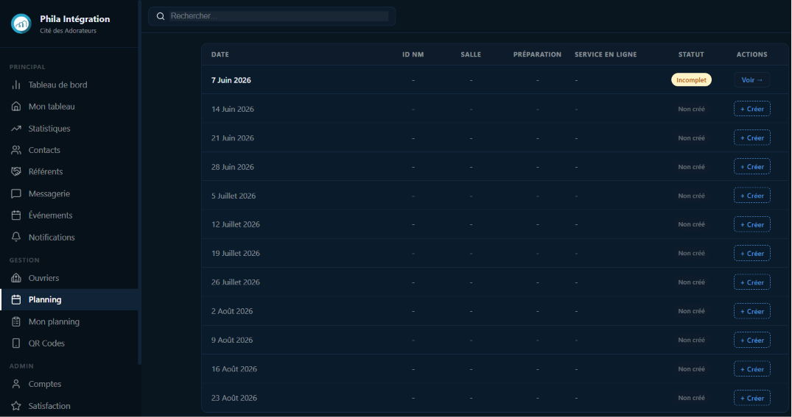

# Phila Intégration

Application web full-stack de gestion de l'intégration des membres pour l'église Phila Cité des Adorateurs (Paris + Paris Nord). Projet en production depuis juin 2026.

[Voir l'application](https://phila-integration-five.vercel.app) -compte de démonstration disponible sur demande.

---

## Présentation

Phila Intégration est une plateforme de suivi pastoral qui couvre l'intégralité du parcours d'un nouveau membre : de son premier formulaire d'inscription via QR Code jusqu'à la remise de son certificat d'intégration en PDF.

L'application centralise la gestion des contacts, automatise les communications WhatsApp, planifie les équipes du dimanche et génère des rapports analytiques pour les responsables d'église.

---

## Aperçu


*Tableau de bord principal avec KPIs et graphiques en temps réel*


*Liste des contacts avec filtres, badges statut et import Excel*


*Fiche contact avec checklist d'intégration en 7 étapes*


*Statistiques avancées : taux de conversion et performance par référent*


*Formulaire public accessible via QR Code*


*Certificat d'intégration PDF généré automatiquement*


*Planning des bénévoles*

---

## Fonctionnalités

**Gestion des contacts**
- Formulaires publics via QR Code (présentiel, en ligne, ouvrier)
- Checklist d'intégration en 7 étapes avec suivi en temps réel
- Champ intention de visite (intégration, visite occasionnelle, transfert...)
- Assignation de référents avec suggestion automatique basée sur la charge
- Certificats d'intégration PDF générés automatiquement (logo + verset biblique)
- Import Excel/CSV avec normalisation des numéros de téléphone (France, RDC, Madagascar)

**Messagerie automatisée**
- Message de bienvenue J+3 via WhatsApp (Twilio)
- Messages d'anniversaire automatiques (contacts et ouvriers)
- Voeux du Nouvel An automatiques
- Questionnaire de satisfaction J+14 avec lien unique par contact
- Templates configurables avec variables dynamiques ([Prenom], [Referent], [Adresse]...)

**Tableaux de bord et rapports**
- Dashboard avec KPIs temps réel et graphiques Recharts
- Statistiques avancées : taux de conversion, temps d'intégration, performance par référent
- Rapport mensuel PDF et rapport annuel PDF
- Rapport hebdomadaire automatique par email chaque lundi
- Résultats du questionnaire de satisfaction avec export PDF

**Sécurité**
- Authentification JWT avec refresh tokens (expiration sessions inactives 3 jours)
- Patch IDOR : autorisation par rôle sur chaque endpoint contact
- Protection timing attack sur l'énumération des emails
- Validation stricte E.164 des numéros de téléphone
- CSP strict via headers Vercel, rate limiting, honeypot anti-spam
- Audit logs complets (toutes les actions + connexions avec IP)

**UX et mobile**
- PWA installable sur iOS et Android (sans App Store)
- Responsive mobile complet audité sur 20 pages
- Mode sombre automatique (suit le thème système)
- Animations Framer Motion sur les interactions clés
- Recherche globale avec debounce 300ms
- Tutoriels contextuels intégrés par page

---

## Stack technique

| Outil | Rôle |
|---|---|
| React 18 + TypeScript + Vite | Frontend SPA |
| Node.js + Express + TypeScript | API REST backend |
| Prisma 7 ORM | Accès base de données |
| PostgreSQL (Neon.tech) | Base de données serverless |
| JWT | Authentification et sessions |
| Twilio | Envoi messages WhatsApp |
| Resend | Envoi emails transactionnels |
| jsPDF + autoTable | Génération PDF (rapports, certificats) |
| Framer Motion | Animations UI |
| Recharts | Graphiques et visualisations |
| Lucide React | Icônes |
| vite-plugin-pwa | PWA installable |
| Jest | Tests unitaires backend (56/56) |
| Playwright | Tests E2E (21/21) |

---

## Architecture

```
phila-integration/
├── frontend/                  # React + TypeScript + Vite
│   ├── src/
│   │   ├── features/          # Modules métier (contacts, ouvriers, planning...)
│   │   ├── pages/             # Pages principales
│   │   ├── components/        # Composants réutilisables (Modal, HelpButton...)
│   │   ├── services/          # API calls et endpoints
│   │   ├── hooks/             # Custom hooks (useCountUp, useIsMobile...)
│   │   └── types/             # Types TypeScript globaux
│   └── vercel.json            # CSP headers + rewrites SPA
└── backend/
    ├── src/
    │   ├── controllers/       # Logique métier par domaine
    │   ├── routes/            # Routes Express avec middlewares
    │   ├── middlewares/       # Auth JWT, CORS, rate limiting
    │   ├── lib/               # Twilio, Resend, cron jobs, PDF
    │   ├── schemas/           # Validation Zod
    │   └── __tests__/         # Tests Jest
    └── prisma/
        └── schema.prisma      # Modèle de données (15 entités)
```

---

## Méthodologie

Ce projet a été conçu et livré en conditions réelles, avec des contraintes de production effectives (lancement le 1er juillet 2026).

**Approche produit**  
Les besoins ont été identifiés directement avec les responsables de l'église. Chaque fonctionnalité a été pondérée selon son impact métier avant d'être implémentée. Certains modules initialement prévus (cellules de prière, chat interne) ont été abandonnés dans cette version, mais sont prévus dans Phila Manager (module de gestion pastorale avancée), dont le développement est prévu pour le deuxième semestre 2026.

**Architecture des décisions**
- Choix de Prisma 7 avec l'adaptateur pg natif pour éviter la latence du moteur Rust en production Railway
- CSP géré uniquement côté Vercel pour éviter les conflits de double-header avec Helmet
- Turnstile Cloudflare remplacé par une protection honeypot + rate limiting, plus adaptée à un accès via QR Code physique
- Mode maintenance via variable Vite (build-time) plutôt qu'un fetch réseau, pour éviter les faux positifs avec le service worker PWA

**Qualité et tests**
- 56 tests unitaires Jest sur les controllers et services backend
- 21 tests E2E Playwright sur les parcours critiques (inscription, login, planning)
- Zéro erreur TypeScript strict en frontend et backend (`tsc --noEmit` propre)
- Audit de sécurité : patch IDOR, timing attack, validation E.164, signature webhook Twilio

**Déploiement**  
Pipeline CI/CD automatique : chaque push sur `main` déclenche un déploiement Vercel (frontend) et Railway (backend). La base de données Neon.tech reste synchronisée via `prisma db push`.

---

## Déploiement

| Service | Plateforme | URL |
|---|---|---|
| Frontend | Vercel | phila-integration-five.vercel.app |
| Backend | Railway | phila-integration-production.up.railway.app |
| Base de données | Neon.tech | PostgreSQL serverless |

---

## Lancement local

Prérequis : Node.js 18+, PostgreSQL ou compte Neon.tech

```bash
# Backend
cd backend
cp .env.example .env
npm install
npx prisma db push
npm run dev

# Frontend
cd frontend
cp .env.example .env
npm install
npm run dev
```

Variables d'environnement backend requises :

```
DATABASE_URL=postgresql://...
JWT_SECRET=...
TWILIO_ACCOUNT_SID=...
TWILIO_AUTH_TOKEN=...
TWILIO_WHATSAPP_FROM=whatsapp:+14155238886
RESEND_API_KEY=...
BACKEND_URL=http://localhost:4000
FRONTEND_URL=http://localhost:5173
```

---

## Tests

```bash
# Tests unitaires backend (Jest)
cd backend && npm test

# Tests E2E (Playwright)
cd frontend && npm run test:e2e
```

---

## Auteur

Développé par **Déhollin Hollat** -Chef de Projet Data & IA  
MBA Big Data & IA en cours  
dehollin.hollat@outlook.fr
